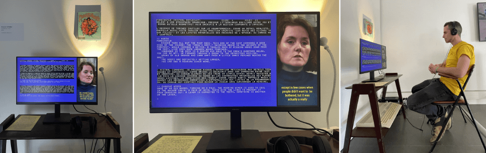

# pLLMdered_hearts

**Interactive installation (or not)**

## Overview

pLLMdered Hearts is an installation that automatically plays *Plundered Hearts* (Infocom, 1987) while displaying an inner voice generated by an LLM. In parallel, a video viewer streams excerpts from Amy Briggs’ interview, selected based on embedding similarity with the LLM’s commentary.

Two narratives intersect: Lady Dimsford in the game, and Amy Briggs in her testimony.

## Architecture

- `src/faketerm.py` drives `frotz`, sends a pre-written solution, cleans the output, and renders the text via a C64-style renderer.
- The LLM does not choose commands: it comments on the situation at each prompt.
- Each comment is embedded (`ollama.embeddings`) and compared to `assets/abriggs-itw-embeddings.json` to select the next video clip (cosine similarity).
- The selection is written to `llm_out/` using a timestamped file, and a cooldown based on `duration_sec` prevents clips from being triggered too quickly.
- The loop restarts after the last command for continuous operation.
- `godot-viewer/` reads `llm_out/`, queues videos, and plays noise when the queue is empty.

## Data and scripts

- `src/embed_vtt.py` generates `assets/abriggs-itw-embeddings.json` from `.txt` subtitles (excluding `-fr`), and adds `sequence_title`.
- `src/translate_subtitles.py` produces `-fr.txt` subtitles with context.
- `src/compute_itw_durations.py` computes `duration_sec` from subtitle timecodes.

## Execution

- Requirements: `frotz`, ROM `roms/PLUNDERE.z3`, `ollama` (models `ministral-3:14b` and an embedding model).
- Run: `python src/faketerm.py` (the Godot viewer can be launched via the executable in `bin/itw-viewer.exe`).
- The viewer can run on its own, but it expects files in `llm_out/`.
- For the Godot executable, use `LLM_OUT_OVERRIDE` in `godot-viewer/main.gd` if the `llm_out/` path is not relative to the executable.

## Notes

- `llm_out/` is the interface between processes (do not write to it manually).
- The walkthrough is fixed; the LLM does not alter gameplay.
- Videos are selected based on semantic similarity, not chronological order.

## Credits

- Amy Briggs interview [by Jason Scott and the "Get Lamp" team](https://archive.org/details/getlamp-interviews?tab=about), licensed under Creative Commons Attribution-ShareAlike.
