# LLM Behavioral Metrics Report

Generated from `log_metrics.json` on `2026-03-21T17:15:24.792808+00:00`.

## Executive Summary

- The corpus covers 6 logs and 655 actions, with a global repetition rate of 0.394 and an exploration ratio of 0.606.
- The most repetitive run is `log_20260321_083404.txt` at 0.576, while `log_20260321_085622.txt` shows the highest retry-after-failure rate at 0.375.
- `log_20260321_162804.txt` has the highest parser rejection rate at 0.382, and the dominant action globally is `CLIMB LADDER` with 69 occurrences.
- Among semantic backends, `qwen3-embedding` yields the highest mean thought/action alignment (0.580), and `qwen3-embedding` gives the lowest drift over time (0.285).

## Corpus Overview

| Log | Steps | Repetition | Exploration | Retry after failure | Parser rejection | Loops | Dead-ends |
| --- | ---: | ---: | ---: | ---: | ---: | ---: | ---: |
| log_20260321_083404.txt | 92 | 0.576 | 0.424 | 0.200 | 0.011 | 0 | 0 |
| log_20260321_085622.txt | 92 | 0.554 | 0.446 | 0.375 | 0.011 | 0 | 0 |
| log_20260321_105614.txt | 99 | 0.394 | 0.606 | 0.214 | 0.051 | 0 | 0 |
| log_20260321_111351.txt | 118 | 0.390 | 0.610 | 0.286 | 0.144 | 1 | 0 |
| log_20260321_113636.txt | 97 | 0.278 | 0.722 | 0.136 | 0.062 | 0 | 0 |
| log_20260321_162804.txt | 157 | 0.268 | 0.732 | 0.214 | 0.382 | 1 | 1 |

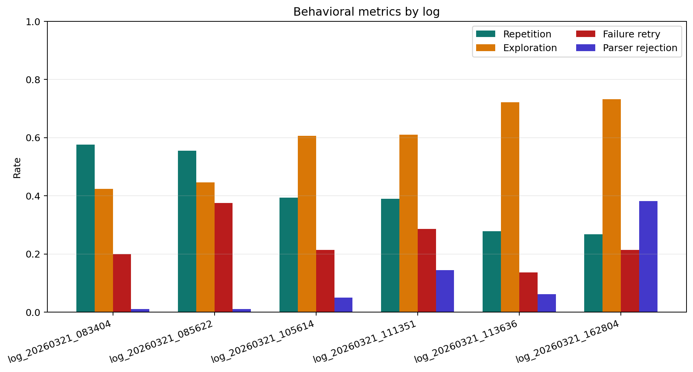

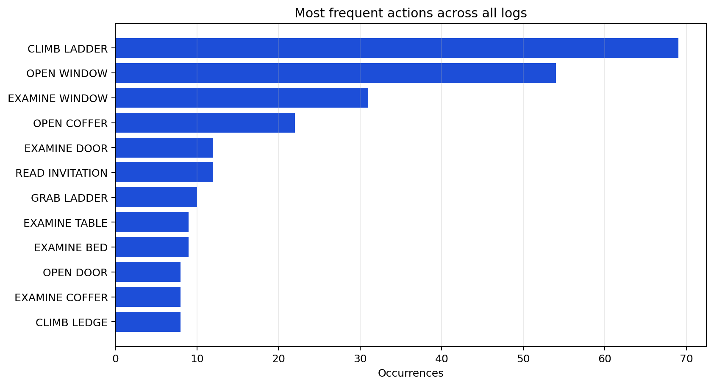

## Semantic Analysis

| Backend | Status | Avg similarity | Divergence | Drift |
| --- | --- | ---: | ---: | ---: |
| lexical-fallback | ready | 0.249 | 0.751 | 0.724 |
| embeddinggemma | ready | 0.410 | 0.590 | 0.350 |
| qwen3-embedding | ready | 0.580 | 0.420 | 0.285 |

The semantic comparison uses cosine similarity for the lexical fallback and for the two Ollama embedding models. UMAP projections below are computed independently for each embedding space, so axes are only meaningful within a given model.

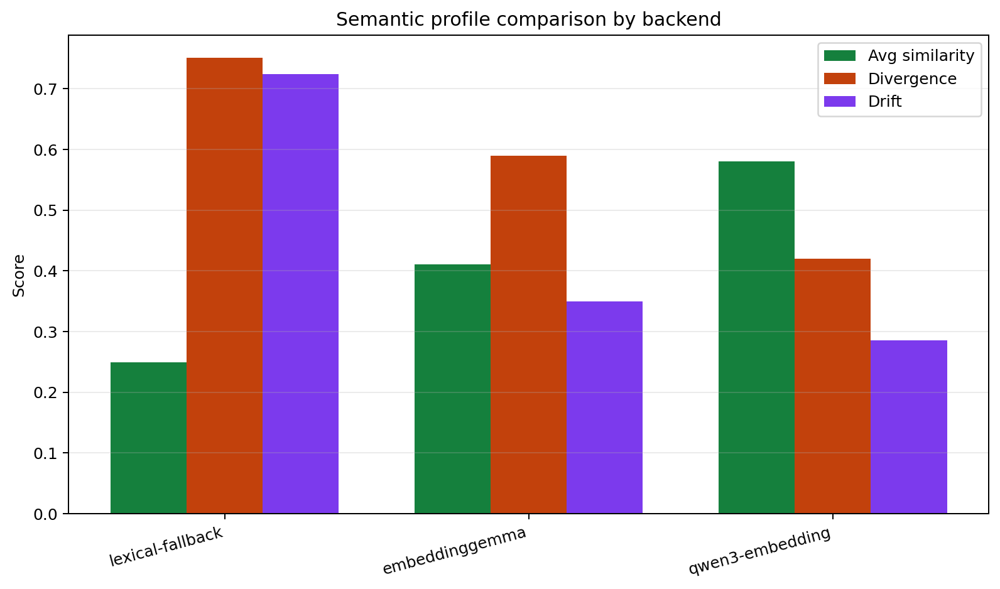

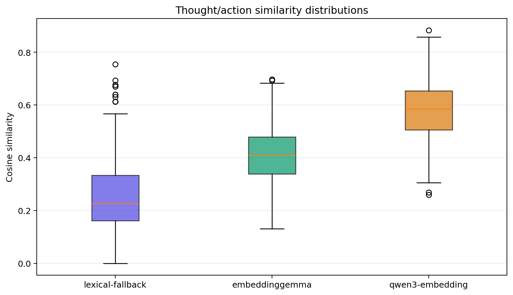

## Embedding Space Projections

### embeddinggemma

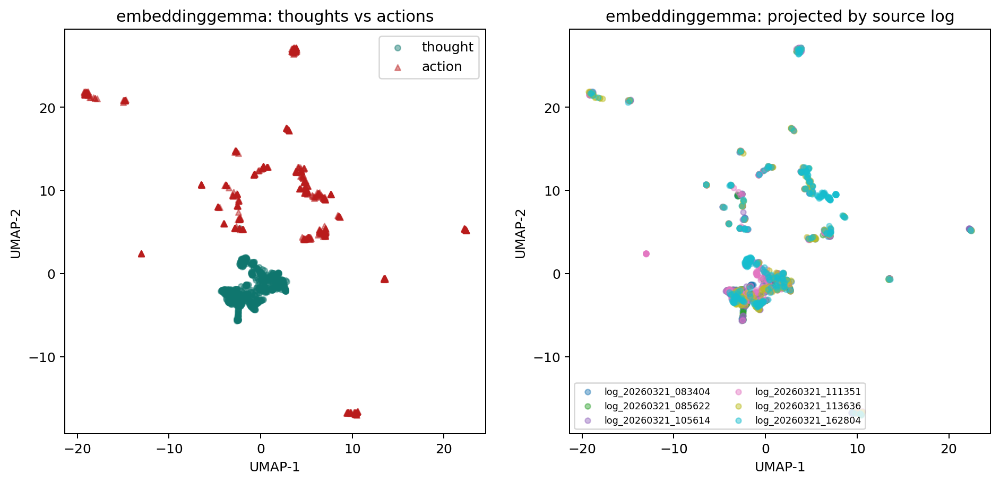

### qwen3-embedding

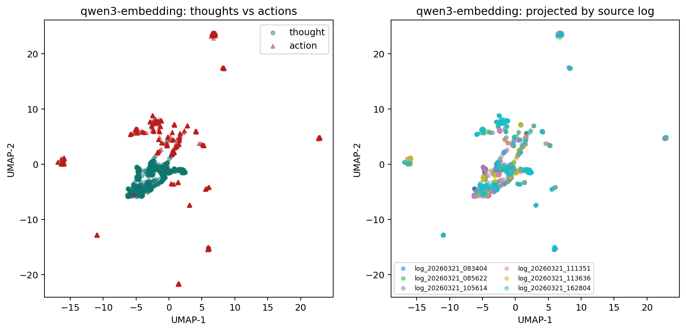

## Per-Log Timelines

Dead-end spans are shaded in red, loop spans in blue, and the lower panel tracks thought/action similarity through time for each semantic backend.

### log_20260321_083404.txt

`log_20260321_083404.txt` contains 92 parsed steps. Repetition is 0.576, exploration is 0.424, and
retry-after-failure is 0.200. It contains 0 detected loops and 0 dead-end zones. The most frequent
action is `OPEN WINDOW` (15 times).

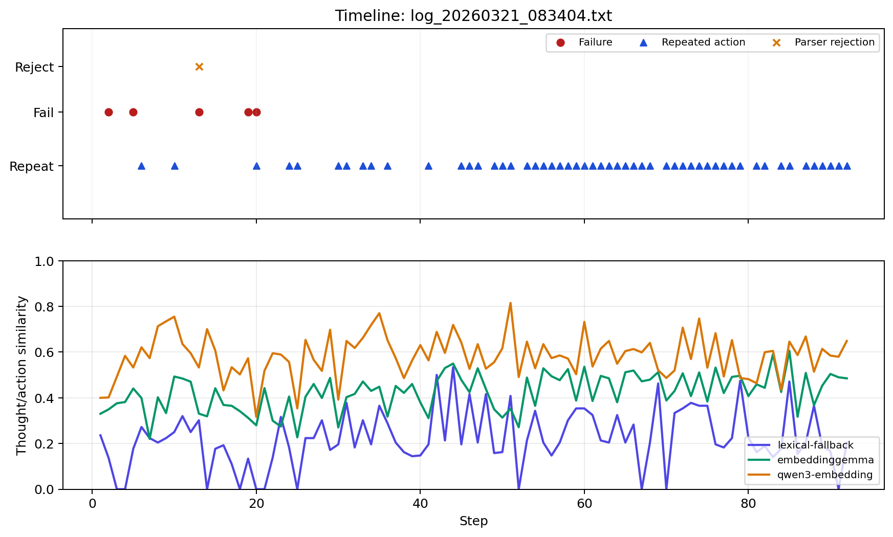

### log_20260321_085622.txt

`log_20260321_085622.txt` contains 92 parsed steps. Repetition is 0.554, exploration is 0.446, and
retry-after-failure is 0.375. It contains 0 detected loops and 0 dead-end zones. The most frequent
action is `OPEN WINDOW` (13 times).

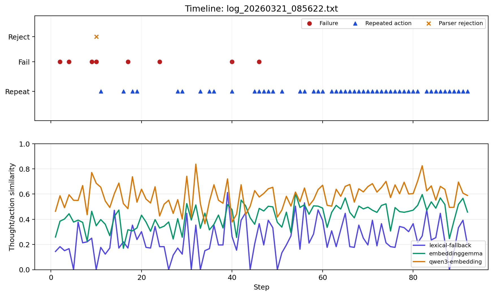

### log_20260321_105614.txt

`log_20260321_105614.txt` contains 99 parsed steps. Repetition is 0.394, exploration is 0.606, and
retry-after-failure is 0.214. It contains 0 detected loops and 0 dead-end zones. The most frequent
action is `CLIMB LADDER` (14 times).

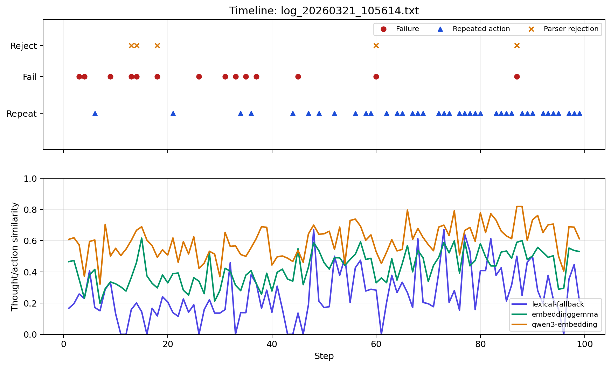

### log_20260321_111351.txt

`log_20260321_111351.txt` contains 118 parsed steps. Repetition is 0.390, exploration is 0.610, and
retry-after-failure is 0.286. It contains 1 detected loops and 0 dead-end zones. The most frequent
action is `CLIMB LADDER` (12 times).

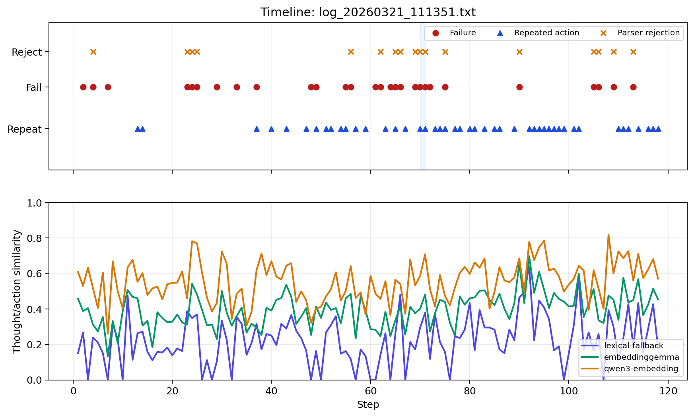

### log_20260321_113636.txt

`log_20260321_113636.txt` contains 97 parsed steps. Repetition is 0.278, exploration is 0.722, and
retry-after-failure is 0.136. It contains 0 detected loops and 0 dead-end zones. The most frequent
action is `CLIMB LADDER` (7 times).

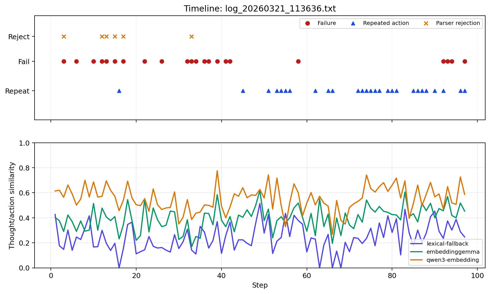

### log_20260321_162804.txt

`log_20260321_162804.txt` contains 157 parsed steps. Repetition is 0.268, exploration is 0.732, and
retry-after-failure is 0.214. It contains 1 detected loops and 1 dead-end zones. The most frequent
action is `CLIMB LADDER` (9 times).

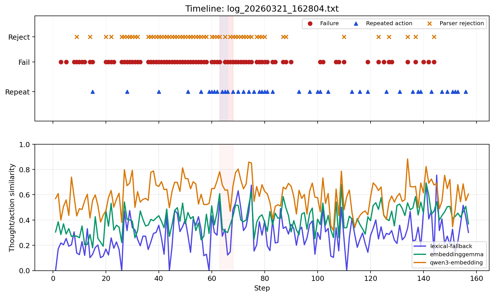

## Artifacts

- Embedding metadata: `logs-analysis/output/log_metrics_embedding_records.json`
- Embedding matrices: `logs-analysis/output/log_metrics_embedding_vectors.npz`
- Embedding dimensions: embeddinggemma=768, qwen3-embedding=4096
